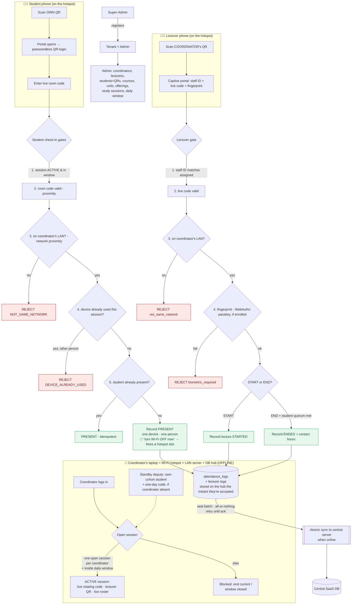

# QAAT — Attendance Flow (current)

**Topology:** the **coordinator's hub** — a **Linux laptop** or a **native Android app** on a phone — is the room's **Wi‑Fi hotspot** *and* the **LAN server + hub** (gateway/embedded server + tenant DB, all offline). **One AP ≈ one classroom:** a hotspot holds ~10 phones (stock Android) to ~20–40 (laptop), so students **rotate** — each turns Wi‑Fi off once marked present to free a slot. Students' and the lecturer's phones join that hotspot and submit logs to it. Every log is stored on the hub the instant it's accepted, then **atomically synced** to a central server when one is online. Multi‑tenant SaaS: each tenant is reached at its own address; QR/links + the WebAuthn RP follow that host.

## The proof factors (anti‑proxy / anti‑ghost)
| Who | Identity | Presence | One‑per‑session |
|---|---|---|---|
| **Student** | personal signed QR → account | live room code **+** on the coordinator's Wi‑Fi | one **person** (account) **and** one **device** |
| **Lecturer** | staff ID **+** phone fingerprint (WebAuthn, if enrolled) | live room code **+** on the coordinator's Wi‑Fi | one assigned lecturer; END needs student quorum |

## Storage & sync
Every accepted log is written to the **coordinator's hub** (laptop DB) immediately and durably — **while completely offline**. On close, the session is sealed into an **AES‑256‑GCM** package, authenticated with a **device‑bound HMAC‑SHA256** and a **SHA‑256 checksum**, and queued in the PWA's offline outbox. The hub then **atomically** syncs the sealed package to the central server (all‑or‑nothing, chunked, retries until acknowledged) — on the offline hotspot it simply waits until the internet is reachable. Nothing is lost; nothing partial is ever committed centrally.

## Viewing progress (separate from check‑in)
Taking attendance uses the student's **QR** (above). To *see* their own attendance % and exam eligibility, a student opens their institution's **passwordless reg‑no portal** and types only their registration number — no account, no login. A reg‑no only ever resolves within its own institution.
