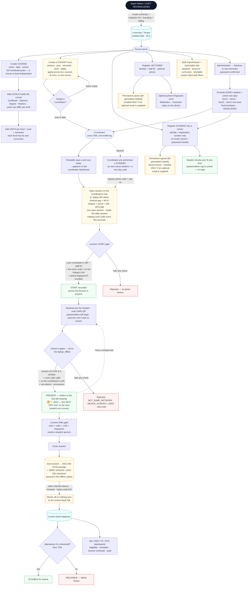
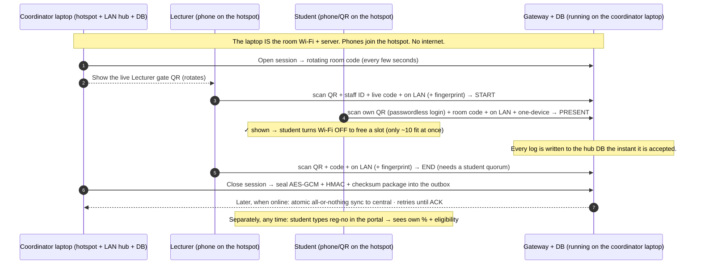

# QAAT — Whole-System Flowchart

> One diagram, end to end. Renders on GitHub & VS Code (Markdown Preview Mermaid).
> **Powered by LIGHT TECHNOLOGIES.**
>
> **The golden rule:** every step of *taking attendance* happens **fully offline**.
> The coordinator's hub (a **Linux laptop**, or a **native Android app** on a phone) is the
> room's Wi‑Fi hotspot **and** the server + database. Phones join that hotspot; no internet is
> touched until the closed session is synced later. See [`docs/FLOWCHART.md`](docs/FLOWCHART.md)
> for the attendance‑gate detail.
>
> **Capacity reality (one access point ≈ one classroom):** a single hotspot only holds a limited
> number of phones at once — **~10 on a stock Android**, ~20–40 on a laptop. So students **rotate**:
> each one turns Wi‑Fi **off** the moment they're marked present, freeing a slot for the next. Large
> groups are served by this rotation over time (minutes), or by several coordinators/APs in parallel.
>
> _Pre‑rendered exports (for viewers without Mermaid):_
> [`flow-1-large.png`](flow-1-large.png) (whole system) · [`flow-2.png`](flow-2.png) (attendance sequence).

```mermaid
flowchart TD
    %% ===== Platform =====
    SA([Super-Admin / LIGHT TECHNOLOGIES]):::owner
    SA -->|create university + Institution ID + branding + billing| T[(University / Tenant<br/>isolated data · RLS)]:::tenant

    %% ===== Admin setup =====
    T --> AD([Tenant Admin]):::role
    AD --> C[Create COURSE<br/>name · dept · school<br/>NO level/total-years — a course is level-independent]
    C --> LV[Add LEVELS inside the course<br/>Certificate · Diploma · Degree · Masters…<br/>years can differ per level]
    LV --> U[Add UNITS per level + year + semester<br/>each level has its own curriculum]
    AD --> CO[Create a COHORT once<br/>session · year · semester · level · intake<br/>apply across ALL courses at once, or one course]:::store
    CO --> ASN{Assign a<br/>coordinator?}
    ASN -->|now or later| COOR([Coordinator<br/>owns ONE cohort/offering]):::role
    ASN -->|leave empty| CO

    %% ===== People =====
    AD --> REG[Register STUDENT into a cohort<br/>identity = registration number only<br/>no email / phone / password needed]
    REG --> SQR[[Permanent signed QR generated instantly<br/>device-bound · emailed ONLY if an optional<br/>email is supplied]]:::store
    AD --> RL[Register LECTURER<br/>identity = staff ID · optional phone]
    RL --> LQR[[Permanent career QR generated instantly<br/>emailed ONLY if an optional email is supplied]]:::store
    RL --> BIO[[Optional phone fingerprint enrol<br/>WebAuthn — biometric stays on the device]]
    AD --> SRCH[[Bulk import/export + searchable lists<br/>students · lecturers · curriculum · timetable<br/>instant client-side filters]]:::store

    %% ===== Daily session (OFFLINE) =====
    COOR --> TT[Timetable says a unit runs today<br/>→ appears on the coordinator dashboard]
    TT --> OPEN[Open session on the coordinator's hub<br/>📡 laptop OR native Android app = Wi-Fi hotspot + server + DB · OFFLINE<br/>one open session · inside the daily window<br/>rotating room code every few seconds]:::store

    %% ===== Standby fallback =====
    COOR -. absent? .-> SB[Coordinator pre-authorises a STANDBY:<br/>an own-cohort student + a one-day code]
    SB -. deputy enters code + reg-no .-> OPEN

    OPEN --> LSTART{Lecturer START gate}
    LSTART -->|scan coordinator's QR + staff ID<br/>+ live room code + on the hotspot LAN<br/>+ phone fingerprint if enrolled| LOK[START recorded<br/>proves the lecturer is present]:::ok
    LSTART -->|fails any check| LX[Rejected — no ghost lecture]:::bad
    LOK --> SCAN[Students join the hotspot · scan OWN QR<br/>passwordless QR-login · read the room code on screen]
    SCAN --> SV{Check-in gates — all on the laptop, offline}
    SV -->|session ACTIVE & in window<br/>+ room code valid<br/>+ on the coordinator's LAN<br/>+ one-device · one-person| PRES[PRESENT — written to the hub DB instantly<br/>📴 “✓ done — turn Wi-Fi OFF now” so the next student can connect]:::ok
    PRES -. frees a hotspot slot .-> SCAN
    SV -->|fails any check| SX[Rejected<br/>NOT_SAME_NETWORK · DEVICE_ALREADY_USED · bad code]:::bad
    PRES --> LEND[Lecturer END gate<br/>scan + code + LAN + fingerprint<br/>needs a student quorum]
    LEND --> CLOSE[Close session]
    CLOSE --> SEAL[(Seal session → AES-256-GCM package<br/>+ HMAC-SHA256 + SHA-256 checksum<br/>queued in the offline outbox)]:::store

    %% ===== Sync (only step that needs internet) =====
    SEAL -->|when internet returns · chunked · retries until ACK| SYNC[[Atomic all-or-nothing sync<br/>to the central SaaS DB]]:::store
    SYNC --> CENTRAL[(Central SaaS database)]:::tenant

    %% ===== Outputs =====
    CENTRAL --> ELIG{Attendance % ≥ threshold?<br/>floor 75%}
    ELIG -->|yes| OKEL[ELIGIBLE for exams]:::ok
    ELIG -->|no| NOEL[INELIGIBLE — deficit shown]:::bad
    CENTRAL --> DASH[QA / DQA / VC / DVC dashboards<br/>eligibility · timetable · lecturer workload · audit]
    REG --> SPORT[Student checks own % any time<br/>passwordless reg-no portal — no login]:::ok

    %% ===== Semester rollover =====
    AD --> ADV[[Administration → Advance to next semester<br/>password-confirmed]]
    ADV --> PROMO[Promote EVERY student + cohort one step<br/>Sem1→Sem2 · Sem2→Sem1 next year<br/>final level/year → GRADUATED]
    PROMO --> COOR
    PROMO --> REG

    classDef owner fill:#0f172a,color:#fff,stroke:#0f172a;
    classDef tenant fill:#ecfeff,stroke:#0891b2;
    classDef role fill:#eef2ff,stroke:#6366f1;
    classDef ok fill:#f0fdf4,stroke:#16a34a;
    classDef bad fill:#fef2f2,stroke:#b91c1c;
    classDef store fill:#fffbeb,stroke:#f59e0b;
```

### The attendance gate, as a sequence (everything here is OFFLINE)

